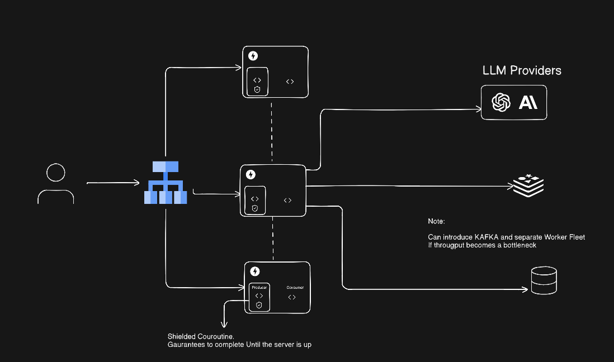

# LLM-FastAPI

A FastAPI-based chat application that integrates with multiple Large Language Model (LLM) providers. It delivers real-time and resilient LLM stream responses using Server-Sent Events (SSE), maintaining persistent storage for responses even if clients break the connection.

## Features

- **Multi-Provider LLM Support**: Integrates with various LLM providers for flexible chat capabilities. Any provider can be added by setting an API key following the naming convention `<PROVIDER>_API_KEY` in uppercase (e.g., `OPENAI_API_KEY`).
- **Asynchronous Response Generation**: Handles async token generation for efficient processing.
- **HTTP Streaming Protocol**: Uses Server-Sent Events (SSE) for real-time streaming of responses.
- **Resilient Storage**: Ensures responses are stored in the database even if the client connection is interrupted.
- **Persistent Chat Conversations**: Stores all chat conversations in a database for retrieval and continuity.
- **Dockerized Deployment**: Easy setup and deployment using Docker and Docker Compose.

## Architecture and Mechanism

The application employs a robust mechanism using two coroutines: a **producer** and a **consumer**.

- **Producer**: Generates tokens from the LLM and flushes them to Redis/DB at regular intervals for persistence.
- **Consumer**: Streams the tokens to the client via SSE.

This design handles several edge cases:
- **User Interrupt**: Users can explicitly interrupt the chat, stopping the stream.
- **Reconnection**: If a client reconnects while the LLM is still generating, the server resumes streaming from the last point.
- **LLM Failures**: Handles cases where the LLM might get stuck or enter a recursive loop, ensuring stability.

Documentation references are added as comments within the codebase for better maintainability.

## Architecture Diagram



Figure: High-level architecture diagram showing the producer/consumer flow and persistence layer.

## Requirements

- Docker
- Docker Compose

## Installation and Setup

1. Ensure Docker and Docker Compose are installed on your system.

2. Clone the repository or navigate to the project directory.

3. Run the following command to start the application:

   ```bash
   docker compose up
   ```

   This will build the necessary images and start the services.

**Note**: Due to an issue with Alembic migrations, if you need to run `docker compose up` again after stopping the services, first run:

```bash
docker compose down
```

Then, run `docker compose up` again.

## Usage

Once the application is running, you can interact with the API endpoints to perform chat operations.


### API Endpoints

- **Health Check**: `GET / or api/v1/health` - Check the health of the application.
- **Chat**: `POST /api/v1/chat` - Initiate a chat session with an LLM provider.
- **Help/Available Models**: `GET /api/v1/help` - Get help information and list available models as per the ENV configured.

For detailed API documentation, refer to the FastAPI auto-generated docs at `http://localhost:8000/docs` when the application is running.

## Configuration

The application uses environment variables for configuration. Key settings include:

- Database connection settings
- LLM provider API keys and endpoints
- Logging levels

To Integrate a new provider add the API KEY in the format of :PROVIDER:_API_KEY
Refer to `src/app/core/config.py` for detailed configuration options.

## Database

The application uses a database (configured via SQLAlchemy and Alembic) to store chat conversations persistently. Migrations are handled by Alembic.

## Testing

Run tests using:

```bash
pytest
```

## Contributing

Contributions are welcome! Please submit pull requests or open issues for any improvements or bug fixes.

## License

This project is licensed under the MIT License.
